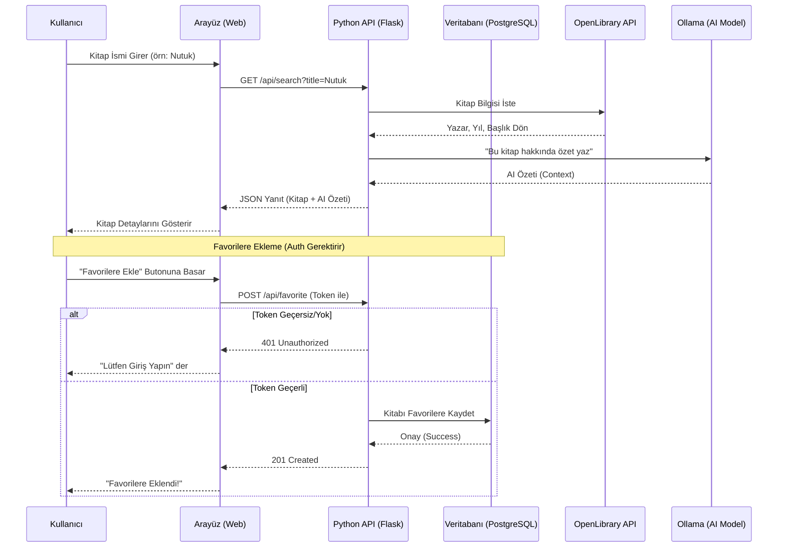

# Library Assistant API

Bu proje, kitap arama ve yapay zeka destekli kitap inceleme servisi sunar. Kullanıcılar ayrıca kayıt olup favori kitaplarını saklayabilirler.

## Proje Hakkında
Bu proje Docker konteynerleri üzerinde çalışacak şekilde tasarlanmıştır. `Flasgger` ile otomatik API dokümantasyonu sunar ve JWT tabanlı kimlik doğrulama kullanır.

## Başlangıç (Kurulum)

1. Docker ve Docker Compose'un yüklü olduğundan emin olun.
2. Proje dizininde terminali açın.
3. Aşağıdaki komutla projeyi başlatın:
   ```bash
   docker-compose down -v  # (Opsiyonel) Temizlik için
   docker-compose up --build -d
   ```
4. Uygulama ve Arayüz: `http://localhost:5000`
5. Swagger Dokümanı: `http://localhost:5000/apidocs`

## Özellikler
- **Kitap Arama:** OpenLibrary API ve Yerel Ollama AI (Gemma) entegrasyonu.
- **Kullanıcı İşlemleri:** Kayıt olma ve Giriş yapma (JWT).
- **Favoriler:** Giriş yapmış kullanıcılar kitapları favorilerine ekleyebilir.
- **Arayüz (Frontend):** Giriş, Kayıt, Arama ve Favori Listeleme tek bir sayfada çalışır.

## Veritabanı
Proje **PostgreSQL** kullanmaktadır. Docker compose içinde otomatik olarak ayağa kalkar.

## Test
Otomatik testleri çalıştırmak için:
```bash
python test_api.py
```

## Sistem Akışı (Sequence Diagram)

Aşağıdaki diyagram, bir kullanıcının kitabı arayıp favorilerine ekleme sürecini göstermektedir.


